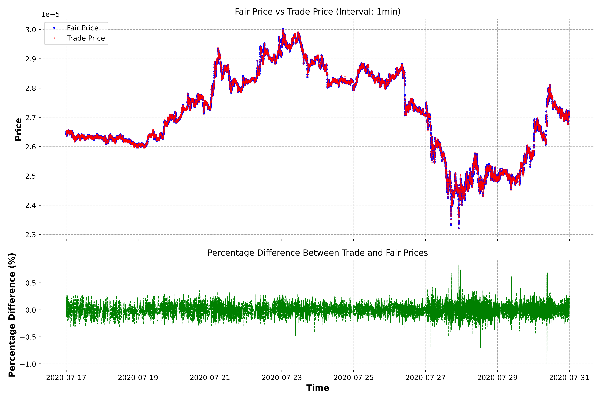

# Research Lead Assignment - C11 Labs


## Overview
This repository showcases my solutions to selected challenges from the C11 Labs Research Lead Assignment. The tasks focus on **algorithmic trading strategies**, spanning topics like **arbitrage detection**, **liquidity pool mechanics**, and **market-making algorithms**. The project highlights my structured approach to solving complex problems in decentralized finance (DeFi).

## Challenges Solved

### **Challenge 2**: Arbitrage in Metronome 1.0
- **Focus**: Analyzed arbitrage opportunities within the Metronome 1.0 cryptocurrency ecosystem.
- **Details**: Explored the protocol’s design and derived mathematical conditions for profitable arbitrage.
- **Outcome**: Identified strategies to exploit price inefficiencies for optimal returns.

### **Challenge 3**: DeFi Liquidity Pool Mechanics
- **Focus**: Examined reserve calculations and swap mechanics within a DeFi liquidity pool.
- **Details**: Modeled price determination and arbitrage scenarios using mathematical frameworks.
- **Outcome**: Demonstrated the impact of trades on pool reserves and price slippage.

### **Challenge 5**: Market-Making Algorithm
- **Focus**: Designed a market-making algorithm leveraging predictive fair value estimation.
- **Details**: Outlined methods for generating optimal quotes, managing risk, and simulating performance.
- **Outcome**: Assessed the algorithm’s strengths and limitations, with potential for machine learning optimization.

## Document Highlights
The detailed solutions are available in [Solutions.pdf](Solutions.pdf), which includes:
- **Methodologies**: A step-by-step explanation of the approaches used for each challenge.
- **Assumptions and Testing**: Documentation of the thought process, assumptions, and validation methods.
- **Simulations**: Visualizations and results to support the findings.

## Learning Outcomes
This project enabled me to:
- Develop a deep understanding of DeFi mechanics and trading strategies.
- Apply mathematical modeling to real-world financial systems.
- Explore the use of simulations and data-driven methods for strategy optimization.

## Running the Code
To replicate the results:

1. Install dependencies:
   ```bash
   ./installation.sh
   ```
2. Navigate to the desired challenge folder:
   ```bash
   cd exerciseXXX
   ```
3. Run the main script using Poetry:
   ```bash
   poetry run python src/main.py
   ```

## Feedback and Contributions
Feel free to explore the repository and reach out with any feedback or questions!

